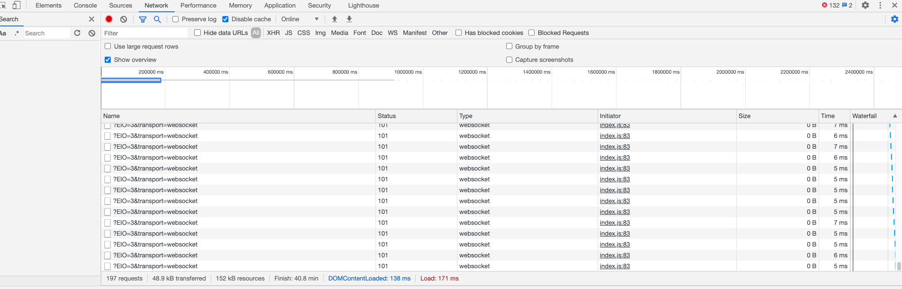

# Flask Socket IO with Httpd 
Flask socket IO example with httpd server 

main purpose of this project to fix httpd socket connection issue to flask which is bit of messy 

https://github.com/MAnasKhalid
requested to solve this 

Note:- this project used python 3.7.6
# Docker Compose
```
$ docker-compose -f docker/docker-compose.yaml up --build
```
try http://0.0.0.0:8080/
# Pytest
```
$ export PYTHONPATH=$(pwd)
$ pytest --cov
```

# Run app locally
```
$  python run.py
```

# screenshots




# kubernetes Helm chart 
Note:- need to set upgrade header in ELB  Load balancer Ingress rule
```
$ cd kubernetes && helm install . --name flask-socket-io --set SECRET_KEY='477fcd746521ea30f2940d8c0934bc95'

```
# Delete chart 
```
$ helm del --purge flask-socket-io;
```